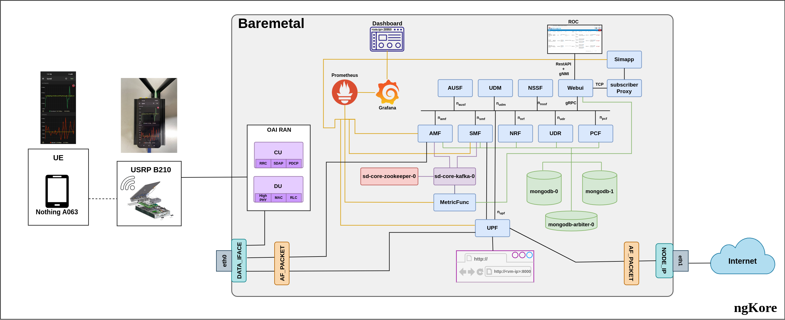

# SD-Core
SD-Core  Af-Packet mode

Firstly clone this repo:
```bash
git clone https://github.com/NgKore47/SD-Core.git
```
Then make the cord directory & clone the sd-core-helm-charts:
```bash
mkdir ~/cord
cd ~/cord/
git clone https://github.com/NgKore47/sdcore-helm-charts.git
```
## Network Architecture:

Then do the following changes in the SD-Core directory: `cd SD-Core`

**This is for the testing PLMN:00101**
Starting by doing the following changes:

#### In SD-Core_Af_Packet, we have to configure the following:
- `~/Aether/sd-core-5g-values.yaml`
	- use external IP for `AMF` --> same as `Data_Iface`
	- ***In the `plmn`, change the `mcc`, `mnc`*** as shown below, this part is very important
	- Also change the `plmn`(first 5 digits) from **`20893`** to **`00101`** in `imsis` section

> NOTE: Here is the list of all the changes that needs to be done on fresh SD-Core with Af-Packet

```patch
diff --git a/sd-core-5g-values.yaml b/sd-core-5g-values.yaml
index b60f3b0..f11d971 100644
--- a/sd-core-5g-values.yaml
+++ b/sd-core-5g-values.yaml
@@ -55,9 +55,9 @@ omec-control-plane:
     amf:
       # use externalIP if you need to access your AMF from remote setup and you don't
       # want setup NodePort Service Type
-      #ngapp:
-        #externalIp: "128.110.219.37"
-        #port: 38412
+      ngapp:
+        externalIp: "192.168.2.183"
+        port: 38412
       cfgFiles:
         amfcfg.conf:
           configuration:
@@ -112,16 +112,16 @@ omec-sub-provision:
             # below block configures the subscribers and their security details.
             # you can have any number of subscriber ranges
             subscribers:
-            - ueId-start: "208930100007487"
-              ueId-end: "208930100007500"
-              plmnId: "20893"
+            - ueId-start: "001010100007487"
+              ueId-end: "001010100007500"
+              plmnId: "00101"
               opc: "981d464c7c52eb6e5036234984ad0bcf"
               op: ""
               key: "5122250214c33e723a5dd523fc145fc0"
               sequenceNumber: "16f3b3f70fc2"
-            - ueId-start: "208930100007501"
-              ueId-end: "208930100007599"
-              plmnId: "20893"
+            - ueId-start: "001010100007501"
+              ueId-end: "001010100007599"
+              plmnId: "00101"
               opc: "981d464c7c52eb6e5036234984ad0bcf"
               op: ""
               key: "5122250214c33e723a5dd523fc145fc0"
@@ -131,20 +131,20 @@ omec-sub-provision:
             device-groups:
             - name:  "5g-gnbsim-user-group1"
               imsis:
-                - "208930100007487"
-                - "208930100007488"
-                - "208930100007489"
-                - "208930100007490"
-                - "208930100007491"
-                - "208930100007492"
-                - "208930100007493"
-                - "208930100007494"
-                - "208930100007495"
-                - "208930100007496"
-                - "208930100007497"
-                - "208930100007498"
-                - "208930100007499"
-                - "208930100007500"
+                - "001010100007487"
+                - "001010100007488"
+                - "001010100007489"
+                - "001010100007490"
+                - "001010100007491"
+                - "001010100007492"
+                - "001010100007493"
+                - "001010100007494"
+                - "001010100007495"
+                - "001010100007496"
+                - "001010100007497"
+                - "001010100007498"
+                - "001010100007499"
+                - "001010100007500"
               ip-domain-name: "pool1"
               ip-domain-expanded:
                 dnn: internet
@@ -166,16 +166,16 @@ omec-sub-provision:
             #if smf is allocating IP address then having 2 separate pools is not a problem.
             - name:  "5g-gnbsim-user-group2" # second device Group
               imsis:
-                - "208930100007501"
-                - "208930100007502"
-                - "208930100007503"
-                - "208930100007504"
-                - "208930100007505"
-                - "208930100007506"
-                - "208930100007507"
-                - "208930100007508"
-                - "208930100007509"
-                - "208930100007510"
+                - "001010100007501"
+                - "001010100007502"
+                - "001010100007503"
+                - "001010100007504"
+                - "001010100007505"
+                - "001010100007506"
+                - "001010100007507"
+                - "001010100007508"
+                - "001010100007509"
+                - "001010100007510"
               ip-domain-name: "pool2"
               ip-domain-expanded:
                 dnn: internet
@@ -217,8 +217,8 @@ omec-sub-provision:
                 - name: "aiab-gnb2"
                   tac: 2
                 plmn:
-                  mcc: "208"
-                  mnc: "93"
+                  mcc: "001"
+                  mnc: "01"
                 site-name: "aiab"
                 upf:
                   upf-name: "upf"  # associated UPF for this slice. One UPF per Slice. Provide fully qualified name
```

## Deployment:
```bash
cd SD-Core
ENABLE_GNBSIM=false DATA_IFACE=ens1f0 CHARTS=latest make 5g-core
```

After all the pods are up and running fine:
Run this command:
```bash
sudo iptables -t nat -A POSTROUTING -o eno1 -j MASQUERADE
```
Here, `eno1 = Node IP`
