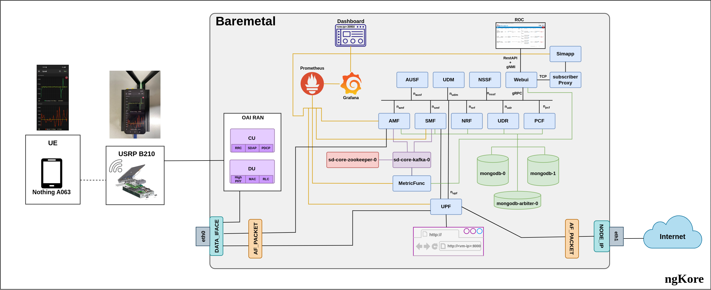
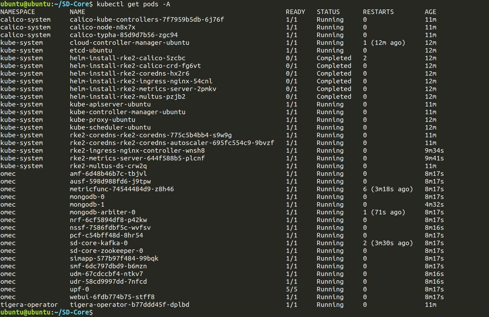

# SD-Core
SD-Core  Af-Packet mode

Firstly install make and clone this repo using:

```bash
sudo apt install make
git clone https://github.com/NgKore47/SD-Core.git
```

Then make the cord directory & clone the sd-core-helm-charts:

```bash
mkdir ~/cord
cd ~/cord/
git clone https://github.com/NgKore47/sdcore-helm-charts.git
```

## Network Architecture:

Then do the following changes in the SD-Core directory: `cd SD-Core`

**This is for the testing PLMN:00101**
Starting by doing the following changes:

#### In SD-Core_Af_Packet, we have to configure the following:

- `~/SD-Core/sd-core-5g-values.yaml`
	- use external IP for `AMF` --> same as `Data_Iface`
	- ***In the `plmn`, change the `mcc`, `mnc`*** as shown below, this part is very important
	- Also change the `plmn`(first 5 digits) from **`20893`** to **`00101`** in `imsis` section

> **Note**: 
> Here is the list of all the changes that needs to be done on fresh SD-Core with Af-Packet

Click [here](./docs/git-diff.md) to see all the changes 

## Deployment:

```bash
cd SD-Core
ENABLE_GNBSIM=false DATA_IFACE=ens1f0 CHARTS=latest make 5g-core
```

> **Note**: 
> Change `ens1f0` according to your system

## Output:


After all the pods are up and running fine,run this command:

```bash
# change eno1 a/c to your setup
sudo iptables -t nat -A POSTROUTING -o eno1 -j MASQUERADE
```
>NOTE: `eno1 = Node IP`
